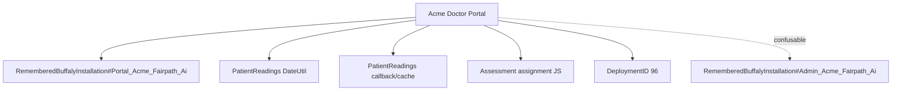

# Create A Subject Matter Expert Research Brief

Use this prompt skill when the user asks to create, build, generate, or prepare a **Subject Matter Expert (SME) research brief** for a topic.

The output should make a future Buffaly session or agent meaningfully smarter about that topic by mining prior session history, ontology, known entities, semantic neighbors, prior conclusions, open questions, validated facts, failed paths, and operational guidance.

The finished document must help a new agent quickly answer:

- What is this topic?
- What should I call it in the ontology?
- What nearby topics might be confused with it?
- What related prototypes/entities/actions should I use?
- What prior work already happened?
- What evidence supports each conclusion?
- Where do I go in session/message history to inspect the original source?

Do not create a giant relationship graph as the main output. The SME document is a briefing memo. Include only a small relationship map for reuse.

## Goal

Given a topic, produce a robust SME background document that answers:

1. What exactly is this topic in this workspace?
2. What prototype/entity names anchor it in the ontology?
3. What adjacent, synonymous, overlapping, or easily confused topics should be explored?
4. What known systems, customers, repositories, URLs, people, sessions, workflows, tools, and deployment targets are connected to it?
5. What have we already learned or done about it?
6. What conclusions were validated?
7. What did we try that failed, drifted, or was risky?
8. What remains uncertain?
9. What should a future agent do differently because of this knowledge?
10. Which session keys, message keys, MessageIDs, or TurnKeys are the reference sources?

## Required Output

Create a markdown document named:

```text
sme-<topic-slug>-research-brief.md
```

Place it in the current session directory unless the user gives another location.

The document must include:

- topic definition,
- ontology/prototype anchors,
- durable ontology subject entity status,
- topic expansion / neighborhood,
- search strategy,
- small relationship map,
- key facts,
- workstreams,
- decisions/conclusions,
- operational guidance,
- risks,
- open questions,
- evidence appendix with session/message references,
- starter prompt for a new session.

Final response must include:

- path to the SME document,
- canonical ontology subject entity created or updated,
- concise summary of what was researched,
- ontology/prototype anchors,
- most important conclusions,
- known open questions,
- suggested next steps.

---

# Workflow

## Phase 1: Interpret Topic And Create A Working Definition

Start by interpreting the user's requested SME topic.

Examples:

- "Acme Doctor Portal"
- "Gmail attachments"
- "Pylo integration"
- "Buffaly upgrade runner"
- "FairPath birthday cards"

Write:

```markdown
## Initial Topic Interpretation
Requested topic: <user wording>
Working definition: <your best interpretation>
Likely entity type(s): <customer/site/tool/repository/workflow/person/etc.>
Likely adjacent topics: <list>
Likely non-goals: <list>
```

Do not ask a clarifying question yet unless the topic is so ambiguous that ontology/search could cause harmful misrouting.

## Phase 2: Resolve Ontology / Prototype Anchors First

Before searching messages, resolve the topic through ontology.

Run entity searches using multiple phrasings:

1. Direct:
   - `<topic>`
2. Expanded:
   - `<topic> customer tenant portal workflow repository contact deployment integration issue`
3. Confusion-oriented:
   - `<topic> aliases adjacent similar confusing related`
4. Domain-specific:
   - Add known domain words from the user request, such as `FairPath`, `Gmail`, `Buffaly`, `Google Workspace`, `Acme`, `Doctor Portal`, or `upgrade runner`.

Use semantic entity search as needed. Rephrase when results are weak or broad.

Look for:

- canonical prototypes,
- remembered entities,
- customer/company entities,
- remembered installations,
- websites/portals,
- repositories/projects,
- people/contacts,
- databases,
- deployment targets,
- tools/actions/skills,
- prompt/action artifacts,
- ontology notes,
- aliases/entity names,
- related prototypes.

For each candidate, record:

```markdown
| Entity / Prototype | Type | Why relevant | Key fields / notes | Confidence |
|---|---|---|---|---:|
```

Then choose:

```markdown
Primary ontology anchor:
- <PrototypeName#Instance>

Secondary anchors:
- <PrototypeName#Instance>
- <ToolOrSkillPrototype>

Adjacent/confusable anchors:
- <PrototypeName#Instance> — why it might be confused
```

Important:

- Use exact prototype names where possible.
- Include enough prototype/entity names that a new agent can find them again.
- If no canonical prototype exists, say so and record the best search terms.

Example:

```markdown
Primary ontology anchor:
- RememberedBuffalyInstallation#Portal_Acme_Fairpath_Ai

Secondary anchors:
- RememberedBuffalyInstallation#Admin_Acme_Fairpath_Ai
- SessionManagementSkill
- ToSearchSessionFinalAssistantMessages
- ToSearchSessionMessages

Adjacent/confusable:
- RememberedBuffalyInstallation#Admin_Acme_Fairpath_Ai — Admin portal, not Doctor Portal.
- RememberedBuffalyInstallation#Portal_If_Fairpath_Ai — another Doctor Portal slug, not Acme.
```

## Phase 2.5: Ensure A Durable Subject Ontology Entity Exists

Before finalizing the brief, ensure the SME subject has a durable ontology entity in the correct location.

This is mandatory. The finished SME document should not be the only durable record of the topic.

Use the existing ontology and memory-authoring patterns/tools when available. Prefer dedicated ontology/memory tools over direct `.pts` editing. Create or update only the smallest appropriate ontology object; do not create duplicates when a canonical entity already exists.

Decision rules:

1. If a precise canonical subject entity already exists, update that entity so it references the SME research document.
2. If only broad or adjacent anchors exist, create a subject-specific entity in the correct ontology/memory location and link it to those anchors.
3. If the subject is an installed system, document, customer, skill, workflow, prompt action, repository, or deployment target, place or update it according to the existing local ontology organization for that entity type.
4. If no clear entity type exists, create the closest durable remembered/workspace entity that future agents can find by semantic entity search.
5. If ontology creation is blocked by missing tools or true ambiguity, record the blocker in the SME document and include the exact proposed entity name, type, location, and fields.

The ontology entity must reference the research document. Include at minimum:

- canonical subject name,
- aliases/search terms,
- concise description,
- prototype/entity anchors and related prototypes,
- path to the SME research document,
- originating session key,
- source/evidence summary,
- date created or updated,
- open questions or cautions when relevant.

Record this in the SME document:

```markdown
## Durable Ontology Subject Entity

Status: created | updated | existing-with-reference | blocked
Entity / Prototype: <PrototypeName#Instance or proposed name>
Ontology location: <file/node/location/tool used>
Research document reference stored on entity: yes | no
Notes: <what was written or why blocked>
```

Also include the entity reference in the starter prompt so future sessions can bind to it first.

## Phase 3: Topic Expansion / Neighborhood Exploration

Before finalizing search terms, expand the topic neighborhood.

The goal is to discover:

- synonyms,
- alternate names,
- related systems,
- related people,
- related files/classes/functions,
- adjacent but distinct entities,
- overlapping workstreams,
- common confusions,
- prior correction terms,
- customer-language terms,
- error-message terms.

Use:

- ontology entity names,
- aliases,
- prototype details/notes,
- semantic entity search,
- semantic action search if tools/workflows matter,
- initial exact message search results,
- user messages for natural-language terms,
- assistant final messages for summarized terms.

Create a table:

```markdown
## Topic Expansion / Neighborhood

| Term / Entity | Relationship to topic | Use in search? | Confusable? | Notes |
|---|---|---:|---:|---|
```

Relationship types:

- synonym,
- alias,
- canonical entity,
- parent topic,
- child topic,
- adjacent system,
- related person,
- related file/function,
- deployment target,
- customer-language symptom,
- error text,
- easily confused item,
- prior failed path,
- action/tool.

Examples:

```markdown
| portal.acme.fairpath.ai | canonical URL | yes | no | Doctor Portal target |
| admin.acme.fairpath.ai | adjacent Admin Portal | yes | yes | Often confused with Doctor Portal |
| PatientReadings | child topic | yes | no | Doctor Portal UI workstream |
| DateUtil.UTCToLocal | related function | yes | no | Timestamp conversion |
| portal.if.fairpath.ai | sibling Doctor Portal | maybe | yes | Not Acme |
```

This phase is mandatory. Do not skip it.

## Phase 4: Build A Search Term Matrix

Build a matrix from:

1. User wording.
2. Primary prototype/entity names.
3. Entity aliases.
4. URLs/domains/slugs.
5. Related people.
6. Related error messages.
7. Related files/classes/functions.
8. Related deployments/FileIDs/commit hashes.
9. Related customer issue language.
10. Adjacent/confusable topics.
11. Prototype/tool/action names.

For each term, decide whether to search:

- user messages,
- final assistant messages,
- both.

Use broad searches for orientation and exact searches for evidence.

Search rules:

- Main topic: search both user and final assistant messages.
- Entity names/URLs: search final assistant first, then user if needed.
- Customer symptoms/errors: search user messages first.
- Functions/files/deployment IDs: search final assistant first.
- Confusable topics: search enough to distinguish scope.
- If a search returns weak/no results, rephrase at least once.

Create:

```markdown
## Search Matrix

| Search term | Source of term | Why search it | User search? | Final assistant search? | Notes |
|---|---|---|---:|---:|---|
```

## Phase 5: Run Local Session Searches Systematically

Use the stored-procedure-backed search tools where available:

- `ToSearchSessionMessages` for user messages.
- `ToSearchSessionFinalAssistantMessages` for final assistant responses.

Use semantic conversation search only when:

- exact search misses likely related topics,
- the topic is conceptual rather than literal,
- synonyms are important,
- you need to discover neighboring terms.

When semantic search is used:

- record that it was semantic,
- record why exact search was insufficient,
- record any noise/confidence issues.

For each query, record:

```markdown
| Query | Search type | Role searched | Count | Strong hits? | Notes |
|---|---|---|---:|---|---|
```

Record important no-hit searches too.

Example:

```markdown
| `Acme admin 500.30` | exact SQL | final assistant | 0 | No | Use broader `No connection string set`. |
```

## Phase 6: Extract Evidence With Source References

For each useful hit, capture:

- Search term
- Search type: exact SQL / semantic / ontology / file / other
- Role
- MessageID
- SessionID
- SessionKey if available
- MessageKey
- TurnKey
- Prototype/entity if relevant
- Short snippet
- Why it matters
- Evidence type
- Confidence

Evidence types:

- raw user/customer report
- user correction/constraint
- assistant conclusion
- validated deployment
- validated test/build
- validated runtime behavior
- failed attempt
- risk/caution
- open question
- follow-up task
- ontology anchor
- semantic neighbor

Use this table:

```markdown
## Evidence Appendix

| Search / Source | Type | Role | MessageID | SessionID | SessionKey | MessageKey | TurnKey | Prototype / Entity | Evidence type | Why it matters |
|---|---|---|---:|---:|---|---|---|---|---|---|
```

If SessionKey is unavailable from the search result, write `unknown` and include MessageID/SessionID/MessageKey/TurnKey.

If you can resolve SessionKey safely later, do it. If not, do not block.

In summaries, link back to sources using the available reference identifiers:

```markdown
Source: MessageID 15847258 / SessionID 20185 / MessageKey `a3c...`
```

If a session key is known:

```markdown
Source: [[agent-session:<sessionKey>]], MessageKey `...`
```

## Phase 7: Deepen Important Evidence

Do not rely only on snippets for the most important claims.

For high-value evidence:

- retrieve full message markdown if possible,
- inspect linked files if relevant,
- inspect prototype notes/details if relevant,
- inspect session artifacts if the search result points to a durable task/plan/scratch.

Deepen at least:

- primary ontology anchor,
- top 3-5 final assistant conclusions,
- top 1-3 raw user/customer reports,
- any evidence that changes operational guidance,
- any evidence that appears contradictory.

For each deepened item:

```markdown
| Evidence item | Deepening action | Result |
|---|---|---|
```

## Phase 8: Cluster Evidence Into Workstreams

Group the evidence by workstream, not by raw search term.

A workstream is a coherent area of work such as:

- RPM timestamp display
- Pylo webhook integration
- Doctor Portal deployment
- Gmail attachment retrieval
- upgrade runner migrations
- customer email drafting
- semantic search performance

For each workstream, write:

```markdown
### Workstream: <name>

Problem:
Topic relationship:
Relevant prototypes/entities:
Source references:
What triggered it:
What was investigated:
What was found:
What was changed/done:
Validation evidence:
Current status:
Known risks:
Open questions:
Recommended next action:
```

Include source references inline:

```markdown
Validation evidence:
- Deployment completed successfully with FileID 1174. Source: MessageID 15847258 / MessageKey `a3c...`.
```

## Phase 9: Identify Decisions, Conclusions, And Confidence

Create:

```markdown
## Known Decisions / Conclusions

| Conclusion | Source references | Confidence | Caveat |
|---|---|---:|---|
```

Confidence:

- High: directly validated by build/test/deploy/live check or multiple consistent sources.
- Medium: supported by investigation but no final validation found.
- Low: plausible hypothesis, incomplete thread, or only continuity evidence.

Example:

```markdown
| DateUtil UTC/local conversion caused future-looking RPM timestamps | MessageID 15847258, MessageID 15846551 | High | Check if later deployments superseded FileID 1174. |
```

## Phase 10: Include A Small Relationship Map

Include a compact relationship map to aid reuse. This is not the main artifact.

Use a small Mermaid graph or adjacency list showing:

- primary topic,
- primary ontology anchor,
- secondary anchors,
- major workstreams,
- confusable/adjacent entities.

Keep it small: ideally under 20 nodes.

Example:



If Mermaid is not suitable, use:

```markdown
## Relationship Map
- Topic
  - Primary entity
  - Workstream A
  - Workstream B
  - Adjacent/confusable entity
```

## Phase 11: Capture Operational Guidance

This is one of the most important sections.

Write guidance that tells a future agent how to act differently because of this document.

Include:

- do/don't rules,
- known scripts,
- validation checks,
- deployment targets,
- prototype/entity names,
- tool/action names,
- secret-handling rules,
- when to use semantic search,
- when to ask the user.

Example:

```markdown
## Operational Guidance

### Ontology anchors to use
- Primary: RememberedBuffalyInstallation#Portal_Acme_Fairpath_Ai
- Adjacent: RememberedBuffalyInstallation#Admin_Acme_Fairpath_Ai

### Search tools to use
- ToSearchSessionMessages
- ToSearchSessionFinalAssistantMessages
- ToGetSessionAssistantMessageMarkdown for deep evidence

### When investigating timestamp bugs
1. Do not assume ingestion is wrong.
2. Check display conversion first.
3. Verify live JS asset and cache-busting version.
4. Confirm grid callback execution.
```

## Phase 12: Capture Risks / Cautions

Create:

```markdown
## Risks / Cautions
1. <risk> — source reference.
2. <risk> — source reference.
```

Every risk should be actionable and linked to evidence when possible.

## Phase 13: Capture Open Questions

Create:

```markdown
## Open Questions
| Question | Why it matters | Source reference / origin | Suggested next check |
|---|---|---|---|
```

Do not hide uncertainty. Clearly label it.

## Phase 14: Write The SME Research Brief

Use this structure:

```markdown
# <Topic> SME Research Brief

## Purpose
What this document is for.

## Topic Definition
Define the topic tightly in this workspace.

## Primary Ontology / Prototype Anchors
| Prototype / Entity | Type | Why it matters | Key fields |
|---|---|---|---|

## Adjacent, Synonymous, And Confusable Topics
| Term / Entity | Relationship | Include in future searches? | Confusable? | Notes |
|---|---|---:|---:|---|

## Scope
Included:
Adjacent but not primary:
Excluded:

## Research Method
Entity searches:
Action/tool searches:
Exact message searches:
Semantic searches:
Important no-hit searches:

## Small Relationship Map
<Mermaid or adjacency list>

## Executive Summary
5-10 high-signal bullets.

## Key Facts
| Fact | Confidence | Source references |
|---|---:|---|

## Prior Workstreams
### Workstream 1: <name>
Problem:
Topic relationship:
Relevant prototypes/entities:
Source references:
What was found:
What was done:
Validation:
Current status:
SME guidance:
Open questions:

### Workstream 2: <name>
...

## Known Decisions / Conclusions
| Conclusion | Source references | Confidence | Caveat |
|---|---|---:|---|

## Operational Guidance
Action-oriented guidance.

## Risks / Cautions
Known traps and failure modes.

## Open Questions
| Question | Why it matters | Source reference / origin | Suggested next check |
|---|---|---|---|

## Evidence Appendix
| Search / Source | Type | Role | MessageID | SessionID | SessionKey | MessageKey | TurnKey | Prototype / Entity | Evidence type | Why it matters |
|---|---|---|---:|---:|---|---|---|---|---|---|

## Starter Prompt For A New Session
A concise prompt that loads this SME context into a new agent/session.

## Suggested Follow-Up Searches
Terms to search if deeper detail is needed.
```

## Phase 15: Quality Gate Before Finalizing

Before returning the document, verify:

1. Did you resolve ontology/prototypes first?
2. Did you include exact prototype names?
3. Did you identify adjacent/synonymous/confusable topics?
4. Did you do topic expansion before final search selection?
5. Did you search multiple related terms, not just the seed topic?
6. Did you rephrase weak/no-hit searches?
7. Did you search both user and final assistant messages where appropriate?
8. Did you record important no-hit searches?
9. Did you separate raw facts from conclusions?
10. Did you label confidence and caveats?
11. Did you include workstreams?
12. Did you include a small relationship map?
13. Did you include operational guidance?
14. Did you include risks/cautions?
15. Did you include open questions?
16. Did you include an evidence appendix with MessageID/SessionID/MessageKey/TurnKey?
17. Did you link conclusions back to sources?
18. Did you include a starter prompt for a new session?
19. Is the document useful without reading the whole prior conversation?
20. Did you avoid exposing secrets?

If any answer is no, fix the document before final response.

---

# Agent Behavior Rules

## Ontology Discipline

- Bind to ontology first.
- Prefer canonical prototype names over labels.
- Include prototype/entity names in the document so future agents can rediscover them.
- Separate primary, secondary, and confusable anchors.

## Topic Expansion Discipline

- Always explore the topic neighborhood.
- Include synonyms, aliases, related systems, customer-language symptoms, files/functions, errors, people, and deployment identifiers.
- Mark confusable topics clearly.

## Search Discipline

- Use exact SQL message search for known strings.
- Use semantic search when exact search misses likely conceptual neighbors.
- Rephrase weak searches.
- Search user messages for original symptoms/corrections.
- Search final assistant messages for conclusions/validations.
- Record no-hit searches when informative.

## Evidence Discipline

- Every major conclusion should cite MessageID/SessionID/MessageKey/TurnKey or a known prototype/entity.
- Prefer final assistant messages for conclusions, but check user messages for corrections.
- If a conclusion was later corrected, include the correction.
- Label continuity/Level 2 evidence as continuity evidence, not direct validation.

## Scope Discipline

- Keep the requested topic tight.
- Put nearby items in adjacent/confusable sections.
- Do not expand into a broad customer graph unless requested.

## Secret Handling

- Include secret key names only when useful.
- Never include secret values.

---

# Final Response Format

When done, respond with:

```markdown
Created SME research brief: [[file:<path>|<filename>]]

Summary:
- Topic: <topic>
- Primary ontology anchor: <prototype>
- Searches run: <short summary>
- Main workstreams: <list>

Most important conclusions:
- <conclusion> — Source: MessageID <id> / MessageKey `<key>`
- ...

Open questions:
- ...

Suggested next steps:
- ...
```
